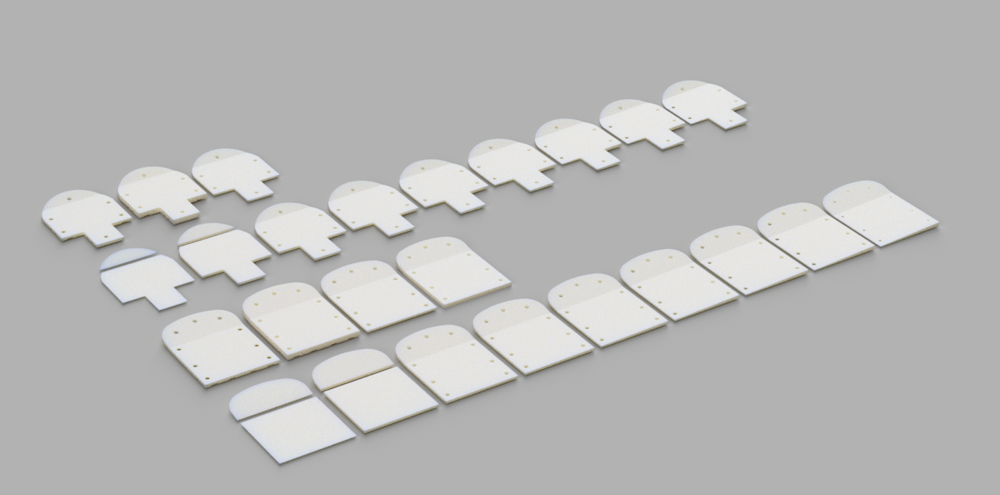

# Ski boot sole canting 

### Ski boot canting system for ISO standard ski boots. Height normalized for plate interchangeability. 

Use with 3mm or 5mm treaded lifters (provided). In case one boot requires no canting, use the 0deg normalized lifter to maintain stack consistency. 

Boot lugs will need to be routed back to DIN spec.

## 3d printing instructions
Print the treaded lifters in something strong. I prefer CF nylon or CF PC, 100% density. Canted plates can be printed in PLA. 

I have tried resin (siraya-tech blue + tenacious), however these resins become brittle in the cold and will crack (even at 100% tenacious mix). FDM is the way to go. 
